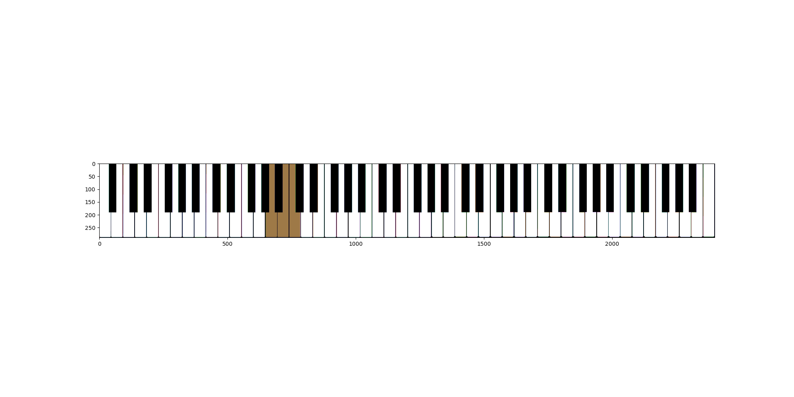

# pianoPlayer
Python code for visualizing music as a series of piano key presses

## Requirements

You'll need to install `imageMagick` in order to export gifs from matplotlib.

On a Mac, this is as simple as 

```brew install imagemagick```.

If you don't have `homebrew` installed, consider doing so!

The code is provided as a python package; you can install it remotely, or clone the repo and run

```pip install . ``` inside the folder.

## Tests

To run the tests, simply run

```pytest``` 

in the root folder.

## Usage

For example usage within Python, see the tests.

If you want to run from the commandline, you can do so using `pianoplayer/player.py`. For example:

```python player.py assets/example_sequence.txt -o assets/example_piano_animation.gif -f 1000 ```

Will use the example input file to create the example output GIF, with a framerate of 1000.

## Examples

See [`pianoplayer/assets`](pianoplayer/assets) for an example of an input sequence file and the resulting GIF.

Here's the kind of output you can expect:



Which corresponds to the sequence of chords:

```
A2 B2 C2
C#6 C#5 A#5
```

Disclaimer: this is not a nice chord progression!
